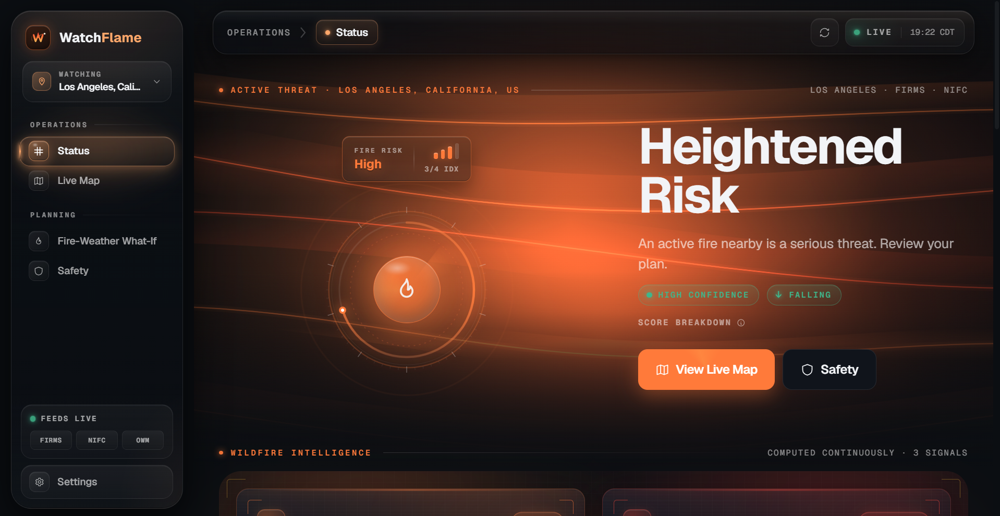
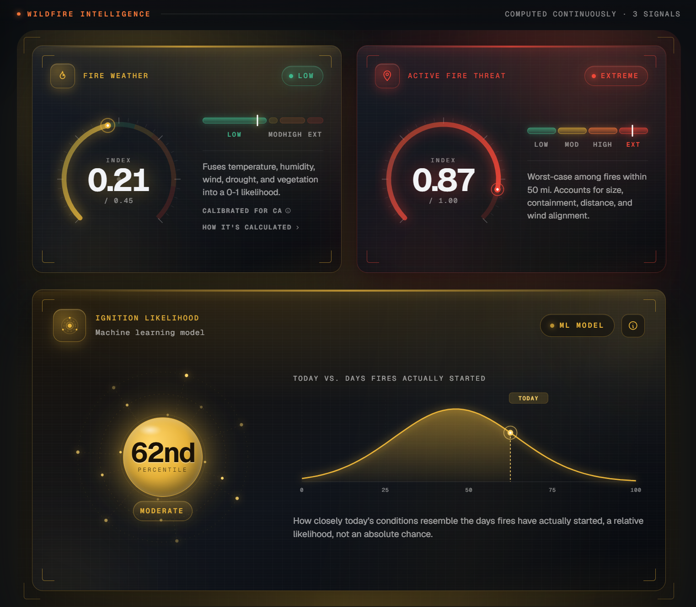
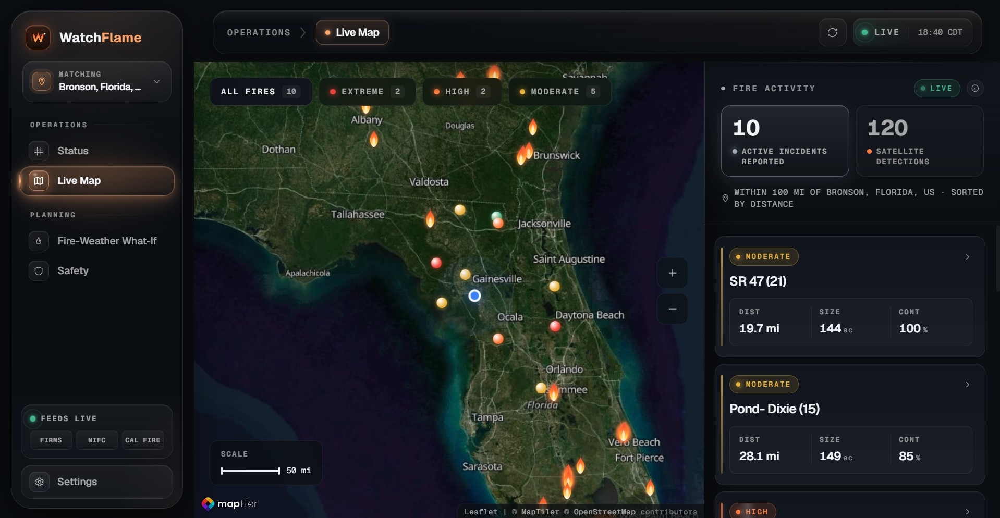
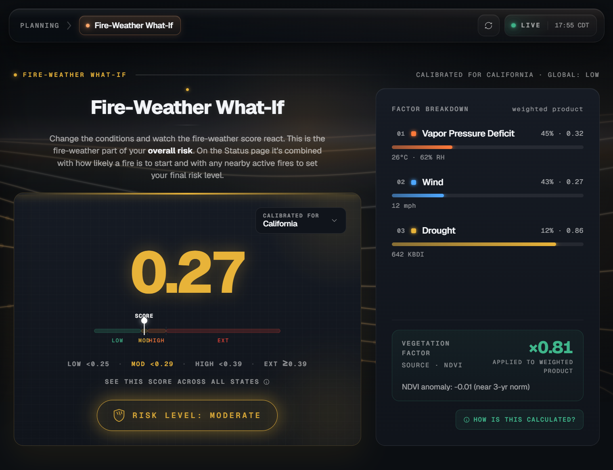
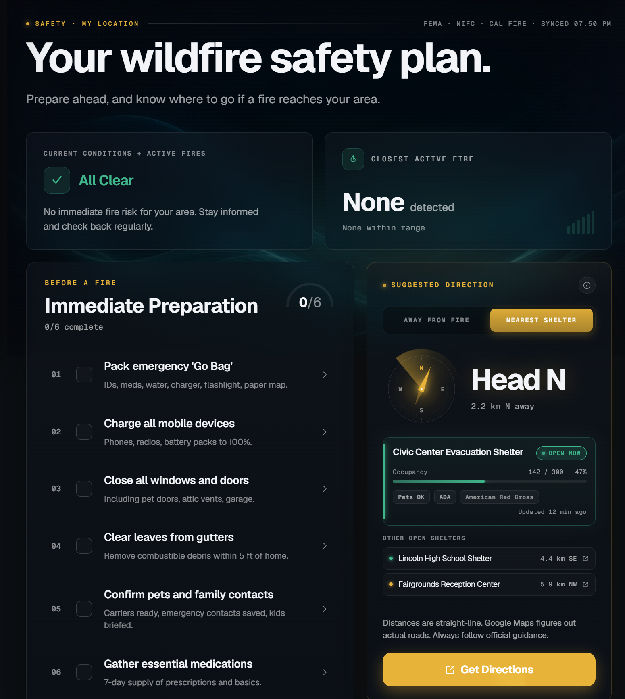
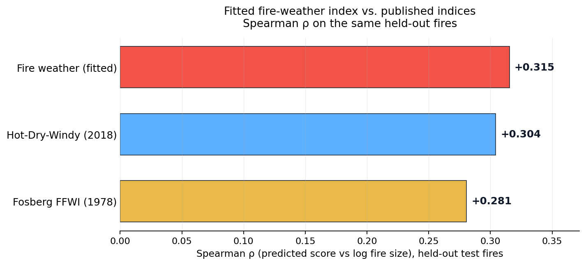
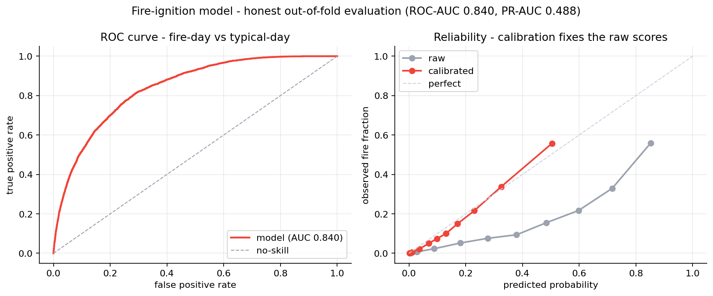

<h1 align="center">
  
  &nbsp;WatchFlame
</h1>

<div align="center">

*Wildfire awareness for any location in the United States.*

[](https://watchflame-wildfire.vercel.app) [](docs/METHODOLOGY.md) [](docs/IGNITION_MODEL_CARD.md) [](LICENSE)

[](https://nextjs.org/) [](https://fastapi.tiangolo.com/) [](https://www.typescriptlang.org/) [](https://www.python.org/)

</div>

Type in a location and WatchFlame shows the current fire risk there, the active fires nearby, and the closest shelters with a suggested direction to head. It pulls live satellite, weather, and vegetation data to do this. The scoring system is fitted to 24 years of federal fire records and tested on fires held out from the fitting.

Wildfire information is scattered, and it usually falls on the reader to interpret the separate pieces: how likely a fire is to start, what is already burning nearby, how dangerous the weather is. Each source shows one signal and leaves you to judge the rest. I built WatchFlame so all of it lives in one place and resolves to a single risk tier, so anyone can know where they stand in a few seconds instead of assembling it themselves.

**▶ Try it live: [watchflame-wildfire.vercel.app](https://watchflame-wildfire.vercel.app)**



<br>

# Features

The four main screens, all built on the same calibrated scoring algorithm and fully responsive on mobile.

### Status



<br><br><br><br><br>
A single risk tier for your location, combining today's fire weather, how likely a fire is to start, and any active fires within 50 mi. It also shows local drought, vegetation stress, the nearest fire driving your risk, and a trajectory for where things are headed.

<br clear="all">

### Live Map



<br><br>
A map of what is burning near you. Named incidents from NIFC and Cal Fire alongside raw satellite detections from NASA FIRMS, sized by acreage and colored by risk. Click any fire for the full breakdown, or use the side tabs to filter down to just the named incidents or just the satellite detections.

<br clear="all">

### Fire-Weather What-If



<br><br><br><br>
A sandbox for the scoring model. Set your own temperature, humidity, wind, drought, and vegetation and the fire-weather score reacts instantly, along with how the same conditions would rate in each of the 17 calibrated states. It runs entirely in the browser with no backend needed.

<br clear="all">

### Safety



<br><br><br><br><br>
Open shelters from the live FEMA National Shelter System with status and capacity, and backup gathering points from OpenStreetMap and the NCES school database, sorted by distance. Includes a suggested direction to head, a checklist, and a button that opens directions in your maps app.

<br clear="all">

<br>

# How the Scoring Works

Every location resolves to one of four tiers: LOW, MODERATE, HIGH, or EXTREME. That single label comes from three things the site measures separately: how dangerous the weather is, how likely a fire is to start, and whether anything is already burning nearby.

1. **Fire weather.** A rule-based index that grades environmental fire-weather severity on a 0-to-1 scale. It uses four inputs: vapor pressure deficit, wind, KBDI drought, and an NDVI vegetation anomaly. The formula is fitted on one split of a set of real historical fires. On the held-out fires it performs as well as the published Hot-Dry-Windy and Fosberg indices. ([the fire-weather index](docs/METHODOLOGY.md#signal-1-fire-weather) · [validation](docs/METHODOLOGY.md#fire-weather-validation))

2. **Ignition likelihood (machine learning).** A gradient-boosted model that asks whether today looks like the days fires actually start. It looks at temperature, humidity, wind, drought, days since rain, the time of year, and the local fuel type. It isn't given coordinates, so it can't memorize which specific places burn. It's also spatially cross-validated, so its accuracy reflects regions it never trained on, and its outputs are probability-calibrated. ([the ignition model](docs/METHODOLOGY.md#signal-2-ignition-likelihood) · [model card](docs/IGNITION_MODEL_CARD.md))

3. **Active-fire threat.** The first two signals are about conditions. This one is about fires that are already burning. For each active fire within 50 miles, it weighs the distance, size, containment, and whether the wind is pushing it toward you. A fire's distance drives the score and its size adjusts it, so a small fire nearby still counts.

**The final tier.** The three signals combine into your risk tier through two lookup matrices rather than a single formula, which lets each combination be tuned directly. ([the composite](docs/METHODOLOGY.md#combining-the-three-signals))

### Per-State Calibration

The tier cutoffs aren't the same everywhere. A 0.45 is EXTREME in humid Florida but only HIGH in dry New Mexico, so one global cutoff would misjudge both of them. Instead, each state's tier bands (LOW / MODERATE / HIGH / EXTREME) are based on that state's own fire history. 17 states are calibrated this way, and the rest fall back to global cutoffs. ([calibration](docs/METHODOLOGY.md#per-state-calibration))

### Performance and Validation

The fire-weather index and the ignition model were both validated against fires they were not fitted to.

<table width="100%">
<tr>
<td width="68%" valign="middle"></td>
<td width="32%" valign="middle"><em>On 151 held-out fires the fitted index reaches Spearman ρ +0.315, performing as well as Hot-Dry-Windy (+0.304) and Fosberg (+0.281), while also using drought and vegetation.</em></td>
</tr>
<tr>
<td width="68%" valign="middle"></td>
<td width="32%" valign="middle"><em>The ignition model ranks a real fire day above an ordinary one about 84% of the time (0.84 ROC-AUC) and stays well-calibrated.</em></td>
</tr>
</table>

### Known Limitations

- The historical fire record leans toward human-caused spring fires, which burn before the landscape greens up. The vegetation signal treats greenness as fuel, so it under-rates that kind of fire.
- The dataset ends in 2015, so the per-state percentile shape should be re-fit periodically against newer fire records.
- NDVI is averaged over a 1 km buffer, so hyper-local fuel state isn't modeled. That resolution is fine for an awareness tool. A fielded operational tool would want finer detail.

<br>

For full details on the formulas, matrices, and validation method, see [METHODOLOGY.md](docs/METHODOLOGY.md), and for the machine-learning model, see [model card](docs/IGNITION_MODEL_CARD.md).

<br>

# Architecture and Tech Stack

How the system fits together, what it's built on, and how it behaves when an upstream goes down.

```
                    ┌───────────────────────────────────┐
                    │   Website · Next.js (web/)        │
                    │   Status · Live Map · What-If ·   │
                    │   Safety · Settings               │
                    └──────────────────┬────────────────┘
                                       │ TanStack Query · HTTPS
                                       ▼
                    ┌───────────────────────────────────┐
                    │      FastAPI backend (uvicorn)    │
                    │  /healthz /fires /risk /weather   │
                    │  /ignition /trajectory /geocode   │
                    │  /shelters /risk/calibration      │
                    │  /incidents/near /disasters/near  │
                    └──────────────────┬────────────────┘
                                       │ async fan-out (httpx),
                                       │ per-upstream fallbacks
                                       ▼
        ┌──────────────────────────────────────────────────────────┐
        │ FIRMS · OWM · Open-Meteo · Copernicus · Census · NIFC ·  │
        │ Cal Fire · FEMA · OpenStreetMap · NCES · NLCD            │
        └──────────────────────────────────────────────────────────┘
```

| Layer | Stack |
|---|---|
| **Frontend** (`web/`) | Next.js 16 (App Router), React, TypeScript (strict), Tailwind v4, TanStack Query, react-leaflet on MapTiler tiles, with custom canvas/SVG rendering for the risk orb, phase-space graph, and animated backgrounds |
| **Backend** (`api/`) | FastAPI on Python 3.11+, async httpx, pydantic v2. The fire-weather index is a transparent rule-based core. A separate scikit-learn ignition model is trained offline and served from a committed artifact. |

The composite math lives in pure, testable functions ([web/lib/composite-risk.ts](web/lib/composite-risk.ts)).

**Graceful degradation.** When an upstream returns 4xx/5xx/timeout, the route logs once and returns an empty or null payload instead of failing the request. Every critical path has a fallback: regional calibration to global cutoffs, NDVI to a calendar season factor, KBDI to a days-since-rain proxy, and open shelters to candidate locations. The Fire-Weather What-If runs with no GPS and no keys at all.

**Hosting and caching.** The frontend is on Vercel, the FastAPI backend on Railway. A request fans out to its upstreams in parallel and comes back in roughly 200 ms once a location is cached. A fully cold location runs about 10 to 15 seconds, because it waits on a fresh Sentinel-2 vegetation read and the free Copernicus tier limits how fast those calls can go. That read is cached on disk for 7 days, or 30 for the monthly normal, and live fire feeds are held in memory for 5 minutes. FIRMS only refreshes every 1 to 4 hours, so a shorter window would not return anything new.

<br>

# Project Layout

```
.
├── api/                      # FastAPI backend
│   ├── core/                 # Pure-Python algorithm + calibration
│   │   ├── risk_algorithm.py #   Multiplicative fire-weather index (RiskParams)
│   │   ├── kbdi.py           #   Keetch-Byram Drought Index
│   │   ├── ndvi.py           #   NDVI anomaly → vegetation factor
│   │   ├── trajectory.py     #   6-hour fire-weather projection
│   │   └── regional_calibration.py
│   ├── routes/               # Endpoint handlers
│   ├── services/             # Async clients per upstream (firms, owm, cdse, ignition, landcover, …)
│   ├── models/               # Committed ignition-model artifact (joblib)
│   ├── data/                 # Per-state calibration thresholds
│   └── tests/                # Backend test suite
├── web/                      # Next.js 16 site
│   ├── app/                  #   App Router pages
│   ├── components/           #   Screen + UI components
│   └── lib/                  #   Hooks, API client, composite-risk math, theme
├── scripts/                  # Fitting, calibration, chart generation
└── docs/                     # METHODOLOGY.md, IGNITION_MODEL_CARD.md, charts, screenshots
```

<br>

# Data Sources

| Source | Provides |
|---|---|
| [NASA FIRMS](https://firms.modaps.eosdis.nasa.gov/) | VIIRS/MODIS satellite fire detections (~1 to 4 hr latency) |
| [OpenWeatherMap](https://openweathermap.org/api) | Current temperature, humidity, wind |
| [Open-Meteo](https://open-meteo.com/) | 365-day weather history → KBDI drought |
| [Copernicus (CDSE)](https://dataspace.copernicus.eu/) | Sentinel-2 imagery → NDVI anomaly |
| [US Census](https://geocoding.geo.census.gov/) | Reverse geocode → state + county |
| [NIFC WFIGS](https://data-nifc.opendata.arcgis.com/) | Named active wildfire incidents (national) |
| [Cal Fire](https://www.fire.ca.gov/incidents) | California-specific named incidents |
| [FEMA](https://www.fema.gov/about/openfema/api) | Disaster declarations + National Shelter System |
| [OpenStreetMap](https://www.openstreetmap.org/) | Community centers / churches as shelter candidates |
| [NCES](https://nces.ed.gov/programs/edge/) | Public schools as shelter candidates |
| [NLCD / EnviroAtlas](https://www.epa.gov/enviroatlas) | Land cover (fuel type) for the ignition model |
| [MapTiler](https://www.maptiler.com/) | Web base-map tiles |
| [FPA-FOD (Kaggle)](https://www.kaggle.com/datasets/rtatman/188-million-us-wildfires) | Historical validation + calibration ground truth |

The 13 rows are 11 live upstreams, MapTiler tiles, and the offline FPA-FOD dataset (used only for validation and calibration). Only NASA FIRMS, OpenWeatherMap, and MapTiler need a key to run the site, and all three are free. Copernicus is an optional free key that unlocks the live vegetation signal. Without it, the score uses a seasonal fallback.

<br>

# Run Locally

WatchFlame is live at [watchflame-wildfire.vercel.app](https://watchflame-wildfire.vercel.app). These steps are for running it yourself or contributing.

The commands below are for macOS and Linux (bash or zsh). Windows differences are noted with the backend steps.

### Prerequisites

- **Python 3.11+** (developed on 3.14): use the [python.org](https://www.python.org/downloads/) installer, not the Microsoft Store stub.
- **Node.js 20.9+** (required by Next.js 16).
- API keys (all free): [NASA FIRMS](https://firms.modaps.eosdis.nasa.gov/api/map_key/), [OpenWeatherMap](https://openweathermap.org/api), and [MapTiler](https://www.maptiler.com/) for the map, with [CDSE](https://dataspace.copernicus.eu/) optional for NDVI.

### Backend

```bash
# from repo root
python -m venv .venv
source .venv/bin/activate
pip install -r api/requirements-dev.txt   # prod deps + tests/lint/notebooks

cp api/.env.example api/.env       # fill in OWM_API_KEY, FIRMS_API_KEY, CDSE_*

python -m pytest api/ -q           # run the full backend suite
python -m uvicorn api.main:app --host 0.0.0.0 --port 8000 --reload
# → http://localhost:8000/docs   (Swagger UI)
```

On Windows, three small differences:

- Activate the virtualenv with `.\.venv\Scripts\Activate.ps1` instead of `source .venv/bin/activate`.
- Copy the env file with `copy` instead of `cp`.
- Keep the `python -m uvicorn` form shown above. The bare `uvicorn` command can be blocked by Windows security, and running it through Python avoids that.

Optional: set `MOCK_OPEN_SHELTERS=1` to populate the open-shelter UI with sample data, since the live FEMA feed is usually empty for a given location.

### Frontend

```bash
cd web
# .env.local needs:
#   NEXT_PUBLIC_API_URL=http://localhost:8000
#   NEXT_PUBLIC_USE_MOCKS=false
#   NEXT_PUBLIC_MAPTILER_KEY=<key>
npm install
npm run dev
# → http://localhost:3000
```

The MapTiler key is inlined into the browser bundle by design, so **domain-lock it in the MapTiler dashboard before any public deploy.**

Optional: set `NEXT_PUBLIC_USE_MOCKS=true` to run the entire UI against bundled fixtures with no backend at all.

<br>

# Testing

The full backend suite is **196 tests**. Run it with:

```bash
source .venv/bin/activate
python -m pytest api/ -q
```

The backend tests cover:

- algorithm correctness (factor floors, KBDI/NDVI overrides, score-bounds sweeps)
- the KBDI and NDVI math
- regional-calibration lookup (including the Reno border-overlap regression and partial-threshold fallback)
- Open-Meteo fetch resilience across 200/4xx/429 responses
- defensive parsing of malformed upstream rows
- the FEMA NSS shelter parser
- the calibration build script (circuit breaker and incremental save)
- end-to-end route tests against every endpoint with mocked upstreams
- a security suite (CORS/config fail-fast, input and bbox validation, rate limiting, safe errors)

The frontend is TypeScript strict (`tsc --noEmit`) and a **Vitest** suite over the pure logic: the composite/threat math, the offline fire-weather scorer, confidence, and FEMA matching. It includes a **Python-to-TypeScript parity test** that asserts the in-browser scorer reproduces the backend's `compute_risk` exactly (fixture from `scripts/export_fireweather_fixture.py`). Run it with `cd web && npm test`.

CI must pass `ruff` and the backend tests (api), along with `tsc`, Vitest, and a production `next build` (web). `eslint`, `pip-audit`, `npm audit`, and `gitleaks` run as advisory or secret-scan checks. See [SECURITY.md](SECURITY.md).

<br>

# Disclaimer

This is an informational tool, not a substitute for emergency services. **Always call 911 first.** The risk score is a research-grade indicator, not a National Weather Service red-flag warning. Shelter "candidates" are general gathering points, not pre-activated emergency shelters, and even the live FEMA-reported open shelters should be confirmed by phone in a real emergency. Cross-check the [Red Cross shelter map](https://www.redcross.org/get-help/disaster-relief-and-recovery-services/find-an-open-shelter.html), [Cal Fire / Ready for Wildfire](https://readyforwildfire.org/), and your local emergency-management agency. A fuller disclaimer lives on the site under **Settings → Important notice**.

<br>

# Credits & License

**Algorithm references.** Fosberg (1978); Goodrick (2002, Fosberg + drought); Keetch & Byram (1968, KBDI); Noble et al. (1980, McArthur); Rothermel (1972); Srock et al. (2018, Hot-Dry-Windy); Tetens (1930).

**Data attribution.** Fire detections: NASA FIRMS (VIIRS/MODIS). Weather: OpenWeatherMap, Open-Meteo. Imagery: ESA Sentinel-2 via Copernicus. Incidents: NIFC WFIGS, Cal Fire. Shelters & declarations: FEMA. Geographies: US Census, OpenStreetMap (© OpenStreetMap contributors, ODbL), NCES. Historical fires: Karen C. Short, *Spatial wildfire occurrence data for the United States, 1992-2015* (FPA-FOD).

**License.** [MIT](LICENSE).
