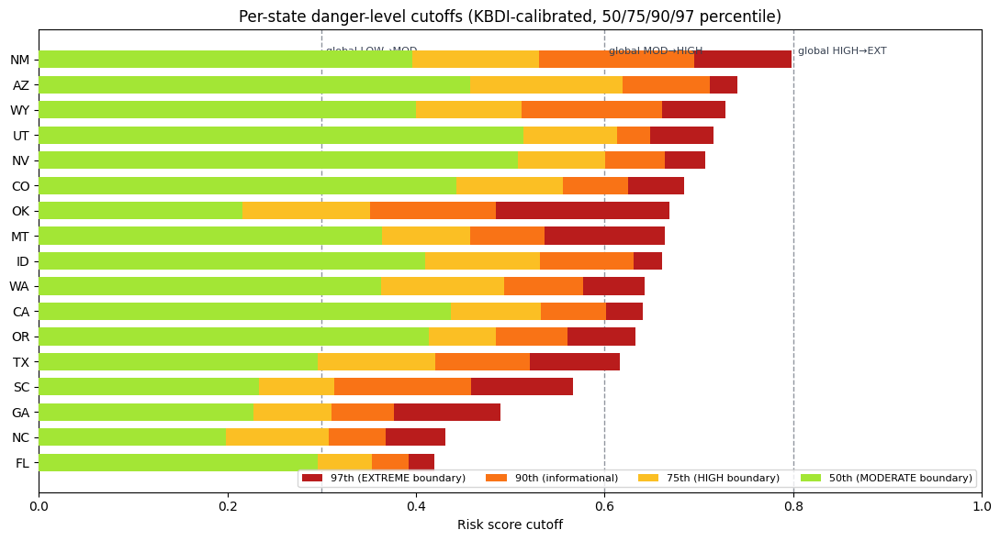
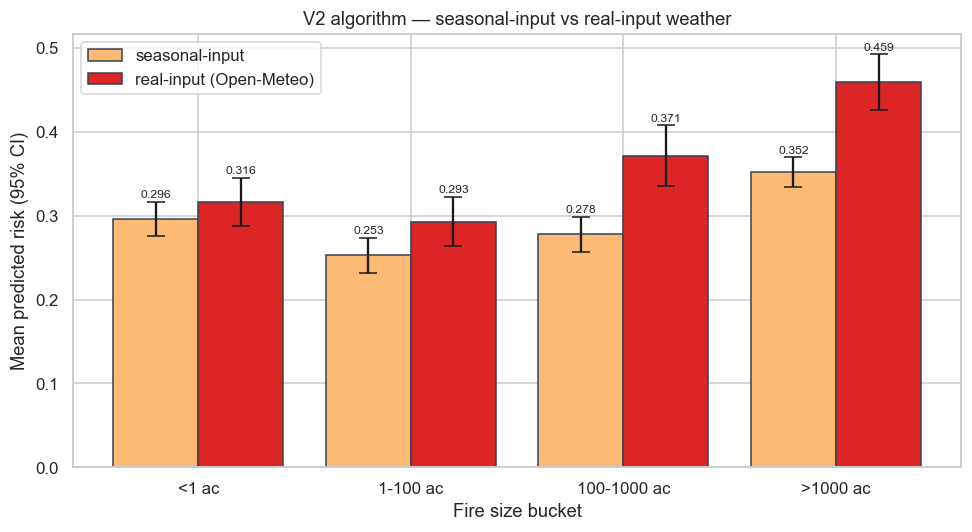

# WildFire

A mobile wildfire-awareness app for the US. Live satellite fire detections, regionally-calibrated risk scoring driven by real per-location vegetation and weather data, evacuation shelter lookup, and a transparent what-if risk calculator — all on your phone via Expo Go.

Built solo as a portfolio project to demonstrate end-to-end product engineering: a real fire-weather algorithm (V4 NDVI anomaly × KBDI × multiplicative VPD with per-state percentile thresholds), live data fusion across nine government and satellite sources, and a mobile UI with intentional motion design and accessibility considerations.

<!-- TODO: hero GIF — Status screen flowing into Map screen, ~3s loop. Should show the orb, the live animated background, and one tap → map view -->

---

## Table of contents

- [What it does](#what-it-does)
- [Screenshots](#screenshots)
- [Architecture](#architecture)
- [The risk algorithm](#the-risk-algorithm)
- [Data sources](#data-sources)
- [Run locally](#run-locally)
- [Project layout](#project-layout)
- [Testing](#testing)
- [Roadmap](#roadmap)
- [Disclaimer](#disclaimer)
- [Credits & license](#credits--license)

---

## What it does

**Status screen** — A live fire-weather score for your current GPS location, calibrated against your state's historical fire-day percentile distribution. Shows the regional danger level, the active drought index (KBDI), the live vegetation-stress signal (NDVI anomaly from Sentinel-2 satellite), nearby active fires, and a FEMA disaster banner when applicable.

**Map screen** — Live NASA FIRMS satellite fire detections plus named-incident overlays from NIFC and CAL FIRE, sized by acreage and color-coded by fire-weather risk. Pull-to-refresh, tap-to-inspect, zoom-aware hit testing, two distinct bottom sheets for the two data layers.

**Risk Calculator** — A slider-driven what-if tool: temperature, humidity, wind, KBDI drought index, and season. The same algorithm that powers the Status score, but driven by hypothetical inputs instead of live weather. Useful for understanding how each input moves the score, and for sanity-checking the algorithm's behavior across the full input space.

**Safety screen** — Nearby fire shelters from OpenStreetMap (community centers, schools) and NCES (US Department of Education's public schools database), sorted by distance and deduped. Direction-of-evacuation arrow and Maps deep-link integration.

**Saved locations** — Save locations as "Home", "Work", "Mom's house", etc. Swap the active location from a long-press on the Status header.

---

## Screenshots

<!-- TODO: Status screen hero shot — wave background visible, hero orb showing risk score, ShimmerPill, headline + subtitle, calibration link, conditions card -->

<!-- TODO: Map screen — at least 3 fire markers visible, one of the bottom sheets open, header chips showing active fires count -->

<!-- TODO: Risk Calculator — all 5 sliders visible mid-position, risk score readout, "Reset to my area" button visible -->

<!-- TODO: Safety screen — shelter list with at least 3 entries, distance + direction arrows visible -->

<!-- TODO: Calibration modal — open over Status, showing the regional explanation + the NDVI anomaly section with a live value -->

---

## Architecture

```
┌─────────────────────────────────────────────────────────────┐
│                     Expo Go (your phone)                    │
│   ┌──────────────┬──────┬──────┬──────────┬────────────┐   │
│   │   Status     │ Map  │ Risk │  Safety  │  Settings  │   │
│   └──────┬───────┴──┬───┴──┬───┴────┬─────┴──────┬─────┘   │
│          │          │      │        │            │         │
│          ▼          ▼      ▼        ▼            ▼         │
│       TanStack Query (request dedup + persistent cache)     │
│            │                                                │
└────────────┼────────────────────────────────────────────────┘
             │ HTTPS (local: laptop LAN IP, prod: Railway URL)
             ▼
┌─────────────────────────────────────────────────────────────┐
│                FastAPI backend (uvicorn)                    │
│                                                             │
│   /healthz   /fires        /risk       /weather             │
│   /geocode   /shelters     /disasters/near                  │
│   /incidents/near          /risk/calibration                │
│                                                             │
└────┬────────────────────────────────────────────────────────┘
     │
     ▼ async fan-out (httpx, graceful degradation per upstream)
┌────────────────────────────────────────────────────────────┐
│ NASA FIRMS │ OWM │ Open-Meteo │ CDSE │ Census │ NIFC │ ... │
└────────────────────────────────────────────────────────────┘
```

**Frontend:** Expo SDK 54 + Expo Router (file-based routing), React Native + TypeScript, NativeWind v4 (Tailwind for RN), TanStack Query with AsyncStorage persistence, Reanimated v4 for the animated backgrounds and orb, react-native-maps for the map screen, react-native-svg for the custom orb and tick rings.

**Backend:** FastAPI on Python 3.14, httpx async client, pure-Python algorithm core (no ML), pydantic v2 for request/response validation, JSON-on-disk caching for NDVI (per-coordinate, 7-day TTL for current / 30-day for climatology), in-memory caching for the live data feeds.

**Design principles** — Graceful degradation on every upstream: when a service returns 4xx/5xx/timeout, the route logs once and returns an empty/null payload rather than 5xx-ing back to the client. Every feature has a fallback: regional calibration falls back to global cutoffs, NDVI falls back to a calendar season multiplier, KBDI falls back to a days-since-rain proxy. The Risk Calculator works fully offline without GPS or API keys.

---

## The risk algorithm

A transparent rule-based fire weather index — no ML — implemented in [api/core/risk_algorithm.py](api/core/risk_algorithm.py). Grades the current environment for fire ignition and growth on a 0–1 scale, like a UV index for fire danger. It does **not** predict that a fire *will* start, and it doesn't describe an existing fire's behavior — it's a severity signal for the local environment.

### Formula (V4)

```
e_s              = 6.1078 · exp(17.27·T / (T + 237.3))         # Tetens / Magnus, hPa
VPD              = e_s · (1 − humidity/100)                    # vapor pressure deficit
vpd_factor       = clamp(VPD / 40, 0, 1)
wind_factor      = clamp(0.2 + 0.8 · (wind_kph / 40)^1.5, 0.2, 1)
drought_factor   = clamp(0.1 + 0.9 · KBDI / 800, 0.1, 1)
ndvi_anomaly     = current_NDVI − same_month_climatology_NDVI
ndvi_factor      = clamp(0.80 − ndvi_anomaly · 1.0, 0.40, 1.00)

raw   = vpd_factor^0.5 · wind_factor^0.3 · drought_factor^0.2
score = ndvi_factor · raw                                      # ndvi_factor REPLACES the
                                                               # old calendar season_mult on
                                                               # the live path; falls back
                                                               # to season_mult when
                                                               # Sentinel-2 is unavailable
```

Multiplicative combination captures the "hot AND dry AND windy" non-linearity — any single mild factor pulls the whole score down. The structure mirrors the published Fosberg, Hot-Dry-Windy, and McArthur fire-weather indices.

### The vegetation-stress signal (NDVI anomaly)

Raw NDVI alone is mostly biome detection — Pacific Northwest forests are always ~0.8, the Arizona desert always ~0.2. **NDVI anomaly** (current minus the same-month climatology averaged over the last 3 years) is biome-agnostic and captures the actual fire-relevant signal: how much drier or sparser the vegetation in a 1 km buffer around you is right now versus its seasonal norm. This is the variable USFS WFAS and similar operational systems use as a fuel-load proxy.

When the Sentinel-2 satellite imagery is unavailable (heavy cloud cover, the user is in the Risk Calculator without GPS), the score falls back transparently to a calendar-based season multiplier. The Status calibration modal surfaces the live NDVI value when present and explains the fallback when not.

### Drought (KBDI)

The Keetch-Byram Drought Index (Keetch & Byram 1968) — the operational soil-moisture deficit metric the US Forest Service uses. Computed daily by integrating a year of precipitation and evapotranspiration history from [Open-Meteo's free archive](https://open-meteo.com/) (no API key required), keyed to a 0.1° grid cell so two users in the same metro area share one cached compute.

This is far more honest than V1's "days since rain" proxy because two weeks of dry weather in Florida humidity is not the same drought as two weeks in Arizona — KBDI captures both.

### Per-state regional calibration

A score of 0.55 in Florida is a high fire-risk day; the same 0.55 in Arizona is fairly routine. A single global cutoff would cry wolf in one and miss real danger in the other.

The calibration script ([scripts/build_regional_thresholds.py](scripts/build_regional_thresholds.py)) samples 100 historical fires per state from the federal FPA_FOD database (Fire Program Analysis, ~1.88M wildfires 1992–2015), pulls real day-of-fire weather from the Open-Meteo Archive, runs `compute_risk` against each, and stores the resulting score distribution's 50th / 75th / 97th percentiles per state. These become the bucket boundaries:

```
LOW       :  score < 50th percentile of fire-day scores in this state
MODERATE  :  50th – 75th
HIGH      :  75th – 97th
EXTREME   :  ≥ 97th  (top ~3% of historically-observed fire days)
```

17 states are currently fitted, covering the highest-fire-risk regions in the US: the entire West (AZ, CA, CO, ID, MT, NM, NV, OR, UT, WA, WY), the SE belt (FL, GA, NC, SC), and TX + OK. Other states fall back to global cutoffs.

For state membership at request time, the route calls the **Census Bureau's reverse-geocoder** (free, no key, cached 24h) — authoritative even for border-overlap points like Reno NV that a bbox+centroid heuristic would misclassify as CA.



Each colored bar is one state's percentile-derived bucket boundaries. Wider bars = larger spread between routine fire-day weather and extreme fire-day weather in that state. Notably narrow: FL/GA/NC (humid SE belt — fire-day weather is concentrated in a tight range). Notably wide: NM/WY (large interior West, more variable conditions).

### Validation

Two notebooks validate the algorithm against the Kaggle 1.88M US Wildfires dataset:

**[notebooks/validation.ipynb](notebooks/validation.ipynb)** — 50,000-fire random sample, monthly aggregate sanity check using seasonal climate normals as input.

**[notebooks/validation_v2.ipynb](notebooks/validation_v2.ipynb)** — Stratified 500-fire sample with real day-of-fire weather pulled from Open-Meteo, 125 fires per size bucket, plus the per-state threshold-fitting analysis behind the regional calibration.

Key result:



Same algorithm, two ways of feeding it inputs. With real per-fire weather, the algorithm separates very-large fires (mean 0.459) from small fires (mean 0.316) with non-overlapping 95% CIs — a 0.14 spread vs. 0.06 with only seasonal climate input. Spearman correlation between `log(fire size)` and predicted risk: **0.272 with real weather**, 0.183 with seasonal-only. Input quality matters as much as formula quality.

<!-- TODO: regenerate the V4 validation chart once the recalibrated regional thresholds settle, to capture the NDVI baseline shift -->

### Honest gaps

- **Spring underweighting.** The Kaggle dataset is dominated by human-caused fires (debris burning) that peak in March–April before vegetation greens up. A vegetation/season-as-fuel proxy under-rates that season. Splitting natural vs. human ignition into separate fitted thresholds is on the deferred roadmap.
- **Climate has shifted since 2015** (the Kaggle dataset's end). Newer fire databases exist (NIFC has 2016+ data) but are less tidily structured; the per-state percentile shape should be re-fit periodically.
- **NDVI is averaged over a 1 km buffer.** Hyper-local fuel state (a single yard, a backcountry trail) isn't modeled. For a portfolio app this is the right scale; for a fielded tool, finer resolution would matter.

---

## Data sources

| Source | What it provides | Endpoint | Key required |
|---|---|---|---|
| [NASA FIRMS](https://firms.modaps.eosdis.nasa.gov/) | VIIRS / MODIS satellite fire detections (live, ~4-hour latency) | Area API | Free (map key) |
| [OpenWeatherMap](https://openweathermap.org/api) | Current temperature, humidity, wind | One Call | Free tier |
| [Open-Meteo Archive](https://open-meteo.com/) | 365-day temperature + precipitation history → KBDI | Archive API | None |
| [Copernicus Data Space Ecosystem](https://dataspace.copernicus.eu/) | Sentinel-2 satellite imagery → NDVI anomaly | Statistical API | Free (OAuth) |
| [US Census Bureau](https://geocoding.geo.census.gov/) | Reverse geocode lat/lon → state + county | Geographies API | None |
| [NIFC WFIGS](https://data-nifc.opendata.arcgis.com/) | Named active wildland-fire incidents (national) | Open Data | None |
| [CAL FIRE](https://www.fire.ca.gov/incidents) | California-specific named incidents | XML feed | None |
| [OpenFEMA](https://www.fema.gov/about/openfema/api) | Active federal disaster declarations | Open API | None |
| [OpenStreetMap Overpass](https://overpass-api.de/) | Community centers / churches as shelter candidates | Overpass QL | None |
| [NCES](https://nces.ed.gov/programs/edge/) | Public schools as shelter candidates | Public Schools API | None |
| [Kaggle: 1.88M US Wildfires](https://www.kaggle.com/datasets/rtatman/188-million-us-wildfires) | Historical validation + calibration ground truth | SQLite dataset | Kaggle account |

Six free upstream services + Kaggle for historical data. **Two API keys total** (NASA FIRMS + OpenWeatherMap). CDSE requires a free account to get OAuth credentials; if you skip CDSE, the NDVI feature falls back transparently to the calendar season multiplier.

---

## Run locally

### Prerequisites

- **Python 3.11+** (3.14 used in development). The Microsoft Store stub does not work — get the official installer from [python.org/downloads](https://www.python.org/downloads/) and check "Add Python to PATH".
- **Node.js 18+** for the Expo dev server.
- **Expo Go** on your phone ([iOS](https://apps.apple.com/app/expo-go/id982107779) / [Android](https://play.google.com/store/apps/details?id=host.exp.exponent)). Same Wi-Fi as the laptop, or use `--tunnel`.
- **API keys** (all free):
  - NASA FIRMS — [map key signup](https://firms.modaps.eosdis.nasa.gov/api/map_key/)
  - OpenWeatherMap — [api signup](https://openweathermap.org/api)
  - CDSE — register at [dataspace.copernicus.eu](https://dataspace.copernicus.eu/) → User Settings → OAuth clients (optional but recommended for V4 NDVI)

### Backend

```powershell
# from repo root
python -m venv .venv
.\.venv\Scripts\Activate.ps1
pip install -r api/requirements.txt

# copy and fill in keys
copy api\.env.example api\.env
# edit api\.env — NASA_FIRMS_API_KEY, OPENWEATHERMAP_API_KEY, CDSE_*

# run tests (should report 97 passed)
python -m pytest api/ -q

# run server
python -m uvicorn api.main:app --host 0.0.0.0 --port 8000 --reload
# → http://localhost:8000/docs   (Swagger UI)
# → http://localhost:8000/healthz
```

Note: `python -m uvicorn` rather than `uvicorn.exe` works around a Windows Application Control quirk that blocks the pip-installed CLI shim. Same workaround applies to other pip-installed CLI tools on Windows.

### Mobile app

```powershell
cd app

# copy and set the API URL
copy .env.example .env
# edit .env: EXPO_PUBLIC_API_URL should be your laptop LAN IP
#   find LAN IP:  ipconfig | Select-String IPv4
#   e.g. EXPO_PUBLIC_API_URL=http://192.168.1.42:8000

npm install
npx expo start

# scan the QR code with Expo Go (same Wi-Fi as laptop)
# different network / Wi-Fi blocks LAN:  npx expo start --tunnel
```

### Smoke tests (optional)

```powershell
# verify CDSE OAuth + NDVI fetch works
python -m scripts._smoke_cdse

# verify KBDI fetch + computation
python -m scripts._smoke_kbdi

# verify regional calibration is loaded and bucketing differently per state
python scripts\_smoke_regional_level.py

# end-to-end /risk smoke
python -m scripts._smoke_risk_e2e
```

---

## Project layout

```
.
├── api/                            # FastAPI backend
│   ├── core/                       # Pure-Python algorithm + calibration
│   │   ├── risk_algorithm.py       # V4 multiplicative fire-weather index
│   │   ├── ndvi.py                 # NDVI anomaly + ndvi_factor mapping
│   │   ├── kbdi.py                 # Keetch-Byram Drought Index
│   │   ├── regional_calibration.py # Per-state percentile bucketing
│   │   └── openmeteo.py            # Shared Open-Meteo fetcher + cache
│   ├── routes/                     # FastAPI endpoint handlers
│   ├── services/                   # Async clients for each upstream
│   │   ├── cdse.py                 # Copernicus Sentinel-2 Statistical API
│   │   ├── ndvi_cache.py           # Disk cache wrapping cdse fetchers
│   │   ├── firms.py, owm.py, ...   # other upstream integrations
│   ├── data/                       # regional_thresholds.json + backups
│   ├── tests/                      # 97 backend tests
│   └── main.py                     # FastAPI app factory + CORS
├── app/                            # Expo React Native app
│   ├── app/                        # Expo Router file-based routes
│   │   └── (tabs)/                 # Tab navigator: status, map, risk, safety
│   ├── components/ui/              # Shared UI components
│   └── lib/                        # Hooks, types, theme, helpers
├── notebooks/                      # Validation + calibration analysis
│   ├── validation.ipynb            # Monthly aggregate sanity check
│   ├── validation_v2.ipynb         # Real-weather per-fire validation + regional fit
│   └── figures/                    # Generated charts
├── scripts/                        # One-off ops and smoke tests
│   └── build_regional_thresholds.py    # Re-fits per-state percentile cutoffs
├── data/                           # Raw FPA_FOD SQLite + per-fetch caches (gitignored)
├── docs/                           # README-embedded charts
├── Procfile, railway.json          # Backend deployment
├── handoff.md                      # Engineering handoff notes (session continuity)
└── README.md
```

---

## Testing

```powershell
.\.venv\Scripts\Activate.ps1
python -m pytest api/ -q
# → 97 passed
```

Backend test coverage:

- **Algorithm correctness** ([test_risk_algorithm.py](api/tests/test_risk_algorithm.py)) — V2 formula correctness, season ordering, factor floors, KBDI override, NDVI override, score-bounds sweep.
- **KBDI math** ([test_kbdi.py](api/tests/test_kbdi.py)) — pure drought-index math, daily integration correctness.
- **NDVI math** ([test_ndvi.py](api/tests/test_ndvi.py)) — anomaly arithmetic, factor monotonicity, clamp bounds.
- **Regional calibration** ([test_regional_calibration.py](api/tests/test_regional_calibration.py)) — bbox lookup, centroid tiebreaker, state-hint precedence (Census), Reno NV border-overlap regression.
- **Open-Meteo fetch resilience** ([test_openmeteo_fetch.py](api/tests/test_openmeteo_fetch.py)) — caching across 200/4xx/429.
- **Build script logic** ([test_build_regional_thresholds.py](api/tests/test_build_regional_thresholds.py)) — circuit breaker, incremental save, quota-vs-data-poverty discrimination.
- **End-to-end routes** ([test_routes.py](api/tests/test_routes.py)) — FastAPI TestClient against all 8 endpoints, mocked upstreams, success + degraded paths.

Frontend uses TypeScript strict mode + `npx tsc --noEmit` for typecheck. No runtime tests yet (interactive testing is via Expo Go).

---

## Roadmap

### Done
- ✅ V2 multiplicative VPD-based fire-weather index (vs V1 additive sum)
- ✅ KBDI integration via Open-Meteo Archive
- ✅ 17-state regional percentile calibration
- ✅ V4 NDVI anomaly via Copernicus Sentinel-2 (replaces calendar season multiplier on live path)
- ✅ Authoritative state lookup via Census reverse-geocoder (fixes border-overlap misclassification)
- ✅ Live fire layer (NASA FIRMS) + named incidents (NIFC + CAL FIRE)
- ✅ Shelter lookup (OSM + NCES) + evacuation direction
- ✅ Saved-locations + UnitsProvider context with AsyncStorage persistence
- ✅ Animated wave/glow backgrounds with focus-pause performance optimization
- ✅ Four in-app explainer modals: regional calibration, map legend, shelter info, disclaimer

### Deferred (in priority order)
- Security review pass (CORS, rate limiting, input audit) before any public deploy
- Railway deploy + custom domain (currently the API only runs from the laptop)
- App icon (1024×1024) + splash screen via `expo-splash-screen`
- Web app port via Expo for Web — main blocker is swapping `react-native-maps` (no web support) for `react-leaflet` or similar, behind `.native.tsx`/`.web.tsx` per-platform files. Roughly 1–2 weeks of work; sequenced after Railway deploy so the web app can hit the live backend. Significantly lower demo friction than Expo Go.
- Further phone-heat reduction. Current state already pauses the Status-screen animations when the screen isn't focused or the app is backgrounded, and the wave-path worklet runs at ~30% lower density than the original design. If long-session users still feel heat, the next levers are: reduce wave count (5→4) and blob count (4→3); migrate `WavesBackground` to `react-native-skia` for GPU-accelerated rendering (biggest single win); respect the OS-level "Reduce Motion" accessibility setting and disable animations when enabled; detect thermal state on iOS (`ProcessInfo.thermalState`) and degrade animations under thermal pressure; lengthen the TanStack Query refetch intervals on Status.
- Push notifications when a fire is detected near saved locations (requires dev build, not Expo Go)
- Lightning vs. human-caused fire split (separate fitted thresholds for ignition source)
- TestFlight + App Store submission path (EAS Build, Apple Developer account, privacy policy)

---

## Disclaimer

This is an informational app, not a substitute for emergency services. **Always call 911 first** in an emergency. The fire-risk score is a research-grade indicator, not a National Weather Service red-flag warning. Shelter locations are community centers and schools selected for their general capacity as gathering points — they are NOT pre-activated emergency shelters. Cross-check the [Red Cross shelter map](https://www.redcross.org/get-help/disaster-relief-and-recovery-services/find-an-open-shelter.html), [CAL FIRE Ready For Wildfire](https://readyforwildfire.org/), and your local emergency management agency in any real emergency.

A more detailed in-app disclaimer appears on first launch in Settings → "Important notice".

---

## Credits & license

Algorithm references:

- Fosberg, M. A. (1978). *Weather in Wildland Fire Management: The Fire Weather Index.*
- Goodrick, S. L. (2002). *Modification of the Fosberg Fire Weather Index to Include Drought.* USDA SRS.
- Keetch, J. J. & Byram, G. M. (1968). *A Drought Index for Forest Fire Control.* USDA SE Forest Experiment Station.
- Noble, I. R. et al. (1980). *McArthur's fire-danger meters expressed as equations.* Australian Journal of Ecology 5: 201–203.
- Rothermel, R. C. (1972). *A Mathematical Model for Predicting Fire Spread in Wildland Fuels.* USDA Intermountain Forest and Range Experiment Station.
- Srock, A. F. et al. (2018). *The Hot-Dry-Windy Index: A New Fire Weather Index.* Atmosphere 9 (7): 279.
- Tetens, O. (1930). *Über einige meteorologische Begriffe.* Z. Geophys 6: 297–309.

Data attribution:

- Fire detections: NASA FIRMS (VIIRS/MODIS sensors).
- Weather: OpenWeatherMap, Open-Meteo.
- Satellite imagery: ESA Sentinel-2 via Copernicus Data Space Ecosystem.
- Named incidents: NIFC WFIGS, CAL FIRE.
- Geographies: US Census Bureau, OpenStreetMap (© OpenStreetMap contributors, ODbL), NCES.
- Historical fires: Karen C. Short. *Spatial wildfire occurrence data for the United States, 1992-2015* (FPA_FOD), via Kaggle.

License: MIT (pending — to be added before publication).
