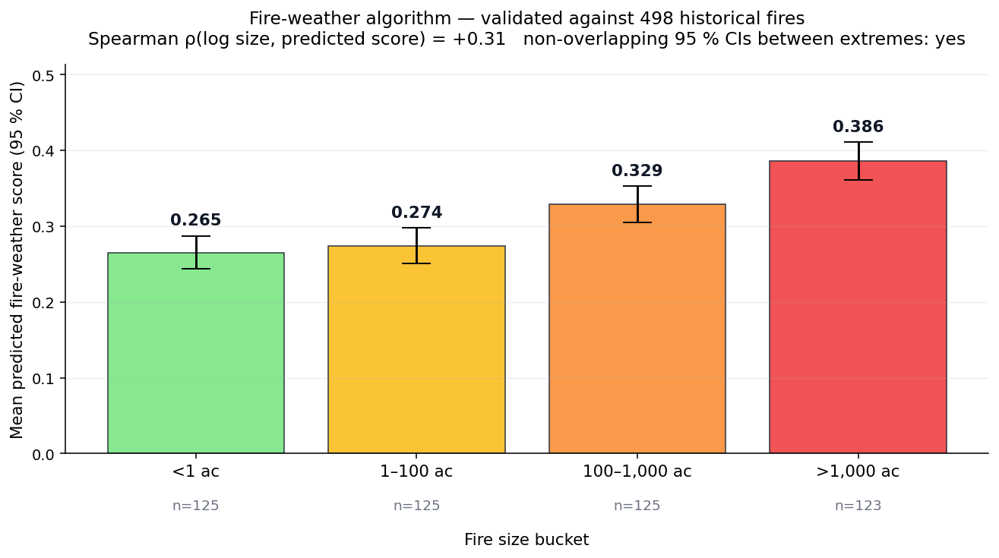
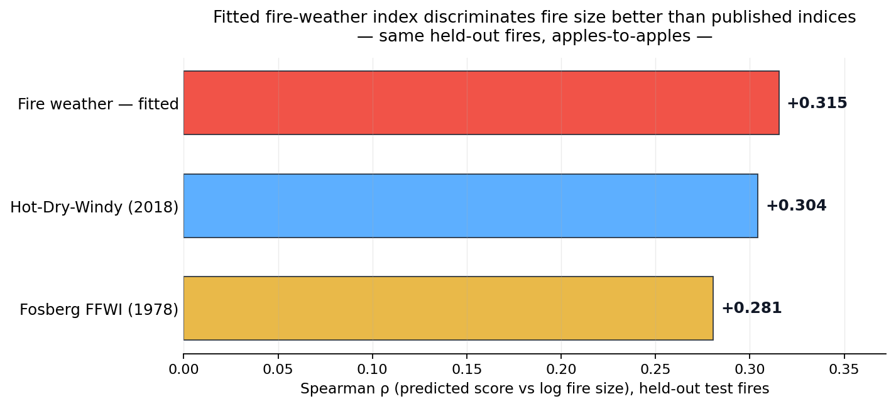

# Ember Watch

[](docs/v4_validation.png) [](docs/regional_thresholds.png) [](docs/DECISIONS.md) [](LICENSE)

A wildfire-awareness web app for the US. It fuses live satellite fire detections, regionally-calibrated fire-weather scoring driven by real per-location weather and vegetation data, an active-fire proximity model, open-shelter lookup, and a transparent what-if risk calculator — all in one product-grade dashboard.

Built solo as a portfolio project to demonstrate end-to-end product engineering: a real, **fit-and-validated** fire-weather algorithm, live data fusion across ten government and satellite sources, and a polished UI with intentional motion design — backed by a typed FastAPI service with graceful degradation on every upstream.

> **The app is "Ember Watch"; the repository is `wildfire-app`.** The primary surface is the **Next.js web app** (`web/`). A parallel Expo/React Native client (`app/`) shares the same backend and algorithm and is feature-tracked but deferred.

---

## Table of contents

- [What it does](#what-it-does)
- [Screenshots](#screenshots)
- [Architecture](#architecture)
- [The risk model](#the-risk-model)
- [Design decisions](docs/DECISIONS.md) — load-bearing engineering choices, each with its cost and the alternative named
- [Data sources](#data-sources)
- [Run locally](#run-locally)
- [Project layout](#project-layout)
- [Testing](#testing)
- [Roadmap](#roadmap)
- [Disclaimer](#disclaimer)
- [Credits & license](#credits--license)

---

## What it does

The app is organized as five screens. Each one is built on the same shared backend and the same calibrated algorithm.

**Command Center (Status)** — A live composite risk tier for your location. It combines two independent axes:

- **Fire weather** — the calibration-aware V4 index (VPD × wind × KBDI drought × NDVI vegetation anomaly), bucketed against your state's own fire history.
- **Active-fire threat** — proximity, size, wind alignment, containment, and detection age of any fire within 50 mi.

These combine through a published **4×5 tier matrix** — not a hand-weighted average. Three click-to-open modals document the math end to end: a **calibration ladder** (where your score lands across all 17 fitted states), a **"Why this score?"** matrix explainer (the exact cell you landed in), and a **confidence breakdown** (the freshness of every upstream signal). The screen also surfaces drought (KBDI), live vegetation stress (NDVI), a 6-hour fire-weather **trajectory**, nearby fires, and a FEMA advisory when one is active.

**Live Map** — NASA FIRMS satellite detections plus named incidents from NIFC and Cal Fire, sized by acreage and tinted by fire-weather risk. Zoom-aware hit testing, click-to-inspect, and two distinct rails for the two data layers.

**Risk Forecast (Calculator)** — A slider-driven what-if tool over temperature, humidity, wind, KBDI, and vegetation. Same algorithm as Command Center, driven by hypothetical inputs instead of live weather — useful for understanding how each factor moves the score. Works fully offline, no GPS or keys required.

**Safety Plan** — Open shelters from the live **FEMA National Shelter System** (with status and capacity) plus potential evacuation points from OpenStreetMap and the NCES school database, sorted by distance. Direction-of-evacuation cue, an evacuation checklist that scales with risk, and a maps hand-off for directions.

**Settings** — Three coordinated dark themes, unit preferences (all browser-local, no account), a full disclaimer, and the complete data-source attribution.

Plus **saved locations** (Home / Work / etc., swappable from the rail) and a per-incident **Fire Detail** page.

---

## Screenshots

<!-- Drop UI captures here. Suggested set:
     1. Command Center hero — orb + headline + confidence chip + trajectory chip
     2. Live Map — markers + incident rail open
     3. Risk Forecast — sliders + score gauge
     4. Safety Plan — open shelter tile + checklist
     5. "Why this score?" matrix modal -->

_App UI captures are kept out of version control; the validation figures below are generated from the committed pipeline._

---

## Architecture

```
┌──────────────────────────────┐        ┌──────────────────────────────┐
│   Web app  (Next.js, primary)│        │  Mobile  (Expo RN, deferred) │
│   Command · Map · Risk ·     │        │   same screens, same algo    │
│   Safety · Settings          │        │                              │
└──────────────┬───────────────┘        └───────────────┬──────────────┘
               │     TanStack Query (dedup + cache)      │
               └────────────────────┬────────────────────┘
                                    │ HTTPS
                                    ▼
                    ┌───────────────────────────────────┐
                    │      FastAPI backend (uvicorn)     │
                    │  /healthz /fires /risk /weather    │
                    │  /geocode /shelters /trajectory    │
                    │  /incidents/near /disasters/near   │
                    │  /risk/calibration                 │
                    └──────────────────┬────────────────┘
                                       │ async fan-out (httpx),
                                       │ graceful degradation per upstream
                                       ▼
        ┌──────────────────────────────────────────────────────────┐
        │ FIRMS · OWM · Open-Meteo · Copernicus · Census · NIFC ·   │
        │ Cal Fire · FEMA · OpenStreetMap · NCES                    │
        └──────────────────────────────────────────────────────────┘
```

**Frontend (`web/`)** — Next.js 16 (App Router) + React + TypeScript (strict), Tailwind v4, TanStack Query, react-leaflet on MapTiler tiles, with custom canvas/SVG rendering for the hero orb, phase-space graph, and animated backgrounds. The composite math lives in pure, testable functions ([`web/lib/composite-risk.ts`](web/lib/composite-risk.ts)).

**Backend (`api/`)** — FastAPI on Python 3.14, async `httpx`, pydantic v2, and a **pure-Python algorithm core (no ML)**. JSON-on-disk caching for NDVI (per-coordinate, with separate TTLs for current vs. climatology) and in-memory caching for the live feeds.

**Design principle — graceful degradation everywhere.** When an upstream returns 4xx/5xx/timeout, the route logs once and returns an empty/null payload instead of failing the request. Every feature has a fallback: regional calibration → global cutoffs, NDVI → calendar season factor, KBDI → days-since-rain proxy, open shelters → candidate locations. The Risk Forecast runs with no GPS and no keys at all.

---

## The risk model

A transparent, rule-based fire-weather index — no machine learning — in [`api/core/risk_algorithm.py`](api/core/risk_algorithm.py). It grades the local environment for fire ignition and growth on a 0–1 scale, like a UV index for fire danger. It does **not** predict that a fire *will* start, and it does not describe an existing fire's behavior.

### 1. The fire-weather index (V4)

Three meteorological factors combine **multiplicatively**, then a vegetation signal scales the result:

```
VPD            vapor pressure deficit from temperature + humidity (Tetens/Magnus)
wind           sustained 10-min wind, saturating at a ~32 mph plateau
drought        Keetch-Byram Drought Index (KBDI, 0–800)
vegetation     NDVI anomaly vs. the same-month 3-year normal (fallback: season factor)

score = (vpd^a · wind^b · drought^c) · vegetation_factor
```

Multiplicative combination captures the "hot **and** dry **and** windy" non-linearity — any single mild factor pulls the whole score down. The structure mirrors the published Fosberg, Hot-Dry-Windy, and McArthur indices.

<details>
<summary><strong>Why each input, and what it really measures</strong></summary>

- **NDVI anomaly, not raw NDVI.** Raw NDVI is mostly biome detection (PNW forests are always ~0.8, Arizona desert ~0.2). The *anomaly* — current vs. the same-month normal over a 1 km buffer — is biome-agnostic and captures how much drier or sparser the vegetation is *right now* versus its seasonal baseline. This is the fuel-load proxy operational systems like USFS WFAS rely on. When Sentinel-2 is unavailable (cloud cover, or the Calculator with no GPS), the score falls back transparently to a calendar season factor.
- **KBDI for drought.** The operational soil-moisture-deficit metric (Keetch & Byram 1968), computed daily from a 365-day precipitation + evapotranspiration window via the free Open-Meteo archive, keyed to a 0.1° grid cell so neighbors share one cached compute. Two dry weeks in Florida humidity is not the same drought as two dry weeks in Arizona — KBDI captures both; a "days since rain" proxy does not.

</details>

### 2. Per-state calibration

A 0.55 in Florida is a dangerous fire day; the same 0.55 in Arizona is routine. A single global cutoff would cry wolf in one place and miss real danger in the other.

The calibration script samples ~500 historical fire days **per state** from the federal FPA-FOD database (~1.88M wildfires, 1992–2015), pulls real day-of-fire weather, scores each with the same V4 algorithm, and stores the **50th / 75th / 97th percentiles** of the resulting distribution as that state's tier boundaries:

```
LOW       score < 50th pctile of the state's fire-day scores
MODERATE  50th – 75th
HIGH      75th – 97th
EXTREME   ≥ 97th    (top ~3% of historically observed fire days)
```

**17 states are fitted** (the entire West, the Southeast belt, plus TX/OK); others fall back to global cutoffs. State membership is resolved at request time via the **US Census reverse-geocoder** — authoritative even for border points like Reno, NV that a bbox heuristic would misclassify.


_Each row is one state's calibrated tier bands. A probe at score **0.45** lands in **EXTREME** in NC/GA/FL, **HIGH** across the middle cluster, and **MODERATE** in NM/AZ/UT/NV/CA — a two-tier swing across the country for an identical raw number. That legibility is exactly what calibration buys._

### 3. The personal-threat composite

Three signals fold into the single headline tier on Status — **fire weather** (`W`, how dangerous the environment is), **ignition likelihood** (`I`, the learned model below), and **active-fire threat** (`T`, how exposed you are to a fire burning right now) — through **two published lookup matrices in series**, not a weighted average.

**Stage 1 — environment.** Fire-weather severity and ignition likelihood are both weather-driven, so bolting `I` on as an independent third axis would double-count it. Instead they fuse multiplicatively into one *environmental danger* tier `E = ENV[W][I]`, symmetric and reading as `consequence × likelihood`:

```
            I=low    I=mod    I=high   I=ext
W=low       LOW      LOW      MOD      MOD
W=mod       LOW      MOD      MOD      HIGH
W=high      MOD      MOD      HIGH     HIGH
W=ext       MOD      HIGH     HIGH     EXT
```

This is also what keeps the learned model honest at the headline: a high ignition reading on a *low-severity* day — a cool, windy day in a dense city — can only reach **moderate** `E`. Likelihood can't escalate the headline without real fire-weather consequence behind it.

**Stage 2 — headline.** The environmental tier then meets the active-fire threat. The threat axis aggregates distance and fire size **multiplicatively** across every fire within 50 mi, then applies smooth **multiplicative modifiers** for wind alignment, containment, and detection age (no hard cliffs — and wind direction can't escalate a far fire it has no physical bearing on). `E` and `T` resolve to the headline through a published **4×5 lookup matrix** (unchanged; just fed `E` in place of `W`):

```
                T=none   T=low    T=mod    T=high   T=ext
E=low           LOW      LOW      LOW      MOD      HIGH
E=mod           LOW      MOD      MOD      HIGH     HIGH
E=high          MOD      MOD      HIGH     HIGH     EXT
E=ext           MOD      HIGH     HIGH     EXT      EXT
```

**Why matrices, not a weighted average?** An earlier version was `0.45·W + 0.55·T`, bucketed by quartile — but those weights were never fitted; they existed only to cap weather-alone risk at MODERATE. The matrices encode that intent directly (`E=ext × T=none → MOD`, a single editable cell) while arguing every other cell on its own merits, and the two-stage split keeps each grid small and individually auditable. Full rationale in [`docs/DECISIONS.md §6`](docs/DECISIONS.md).

### 4. Validation

The constants are **fit, not hand-picked.** The exponents, saturation scales, and floors live in a `RiskParams` dataclass and were fit to maximize Spearman ρ(score, log fire size) on a 70/30 **train split**, with the honest number reported on the **held-out test split**. The 500-fire sample is frozen to a CSV so fitting, benchmarking, and chart regeneration run offline and reproducibly.



- **Spearman ρ = +0.32 on the held-out test split** (+0.31 full sample), up from +0.26 under the original hand-picked constants. Modest but real — a fire-weather index is not a fire-size predictor, and at this sample size ignition-cause variance dominates.
- **Beats published operational indices on the same fires:** fitted V4 (+0.32) edges out Hot-Dry-Windy (+0.30) and Fosberg FFWI (+0.28) — and unlike either, V4 carries the per-state calibration layer on top.
- **Mean score rises monotonically with fire size** — 0.265 (<1 ac) → 0.386 (>1,000 ac) — with **non-overlapping 95% CIs between the extremes.** The algorithm assigns higher fire-weather severity to days that produced large fires, without knowing a fire occurred.



<details>
<summary><strong>Honest gaps</strong></summary>

- The unconstrained fit drove the KBDI exponent toward zero (fire *size* is spread- and VPD-dominated; drought governs ignition more than final size). It's floored at 0.12 to keep the drought integrator load-bearing, costing only +0.006 ρ — argued in [`docs/DECISIONS.md §2`](docs/DECISIONS.md).
- The FPA-FOD sample skews toward human-caused spring fires that peak before green-up, which a vegetation-as-fuel proxy under-rates. Splitting natural vs. human ignition is on the roadmap.
- The dataset ends in 2015; the per-state percentile shape should be re-fit periodically against newer fire records.
- NDVI is averaged over a 1 km buffer — hyper-local fuel state isn't modeled. The right scale for this app; finer resolution would matter for a fielded tool.

</details>

---

## A learned second opinion — ignition likelihood

The rule-based index above asks *how bad could a fire get?* A separate, **gradient-boosted machine-learning model** answers a different question — *do today's conditions resemble the days fires actually start?* The two are orthogonal (severity vs. occurrence) and shown side by side on the Status screen.

- **Trained** on 32,382 examples — 4,897 real fire-ignition days (FPA-FOD + Open-Meteo) vs. "typical day" negatives, both from the *same* fire locations **and** from 3,000 genuinely non-fire background locations, so the model learns conditions + fuel, not geography (`scripts/build_ignition_dataset.py`).
- **Evaluated** with leakage-safe **spatial-block cross-validation** + a logistic baseline: **ROC-AUC 0.840, PR-AUC 0.488** (no-skill 0.500 / 0.151), well-calibrated after isotonic calibration (Brier 0.163 → 0.100).
- **Independently rediscovers the physics:** permutation importance puts **VPD and drought (KBDI) on top** — the same drivers the hand-built V4 index uses. Two methods, one conclusion.
- **Knows where there's nothing to burn (v2):** a land-cover feature (NLCD, with developed-intensity split) plus the background negatives fix the v1 over-flagging of low-fuel cities — a cool, windy spring day in dense-urban **Chicago** dropped from 76th percentile ("high") to 61st ("moderate"), while genuinely dry **Phoenix** stays high. See the [model card](docs/ignition_model_card.md#addressing-the-over-flag-v2).
- **Served live** at `/ignition` as a calibrated percentile index, with training/serving parity (the same feature function runs in training and at request time).


Full write-up: [model card](docs/ignition_model_card.md) · the rule-based-vs-learned design rationale is [DECISIONS §10](docs/DECISIONS.md).

---

## Data sources

| Source | Provides | Key |
|---|---|---|
| [NASA FIRMS](https://firms.modaps.eosdis.nasa.gov/) | VIIRS/MODIS satellite fire detections (~1–4 hr latency) | Free (map key) |
| [OpenWeatherMap](https://openweathermap.org/api) | Current temperature, humidity, wind | Free tier |
| [Open-Meteo](https://open-meteo.com/) | 365-day weather history → KBDI drought | None |
| [Copernicus (CDSE)](https://dataspace.copernicus.eu/) | Sentinel-2 imagery → NDVI anomaly | Free (OAuth) |
| [US Census](https://geocoding.geo.census.gov/) | Reverse geocode → state + county | None |
| [NIFC WFIGS](https://data-nifc.opendata.arcgis.com/) | Named active wildfire incidents (national) | None |
| [Cal Fire](https://www.fire.ca.gov/incidents) | California-specific named incidents | None |
| [FEMA](https://www.fema.gov/about/openfema/api) | Disaster declarations + National Shelter System | None |
| [OpenStreetMap](https://overpass-api.de/) | Community centers / churches as shelter candidates | None |
| [NCES](https://nces.ed.gov/programs/edge/) | Public schools as shelter candidates | None |
| [FPA-FOD (Kaggle)](https://www.kaggle.com/datasets/rtatman/188-million-us-wildfires) | Historical validation + calibration ground truth | Kaggle account |

**Two API keys total** (NASA FIRMS + OpenWeatherMap). CDSE needs a free OAuth account; skip it and NDVI falls back to the season factor. Everything else is keyless.

---

## Run locally

### Prerequisites

- **Python 3.11+** (3.14 in development) — use the [python.org](https://www.python.org/downloads/) installer, not the Microsoft Store stub.
- **Node.js 18+**.
- API keys (all free): [NASA FIRMS](https://firms.modaps.eosdis.nasa.gov/api/map_key/), [OpenWeatherMap](https://openweathermap.org/api), and optionally [CDSE](https://dataspace.copernicus.eu/) for NDVI.

### Backend

```powershell
# from repo root
python -m venv .venv
.\.venv\Scripts\Activate.ps1
pip install -r api/requirements.txt

copy api\.env.example api\.env     # fill in OWM_API_KEY, FIRMS_API_KEY, CDSE_*

python -m pytest api/ -q           # → 143 passed
python -m uvicorn api.main:app --host 0.0.0.0 --port 8000 --reload
# → http://localhost:8000/docs   (Swagger UI)
```

> On Windows, `python -m uvicorn` avoids an Application Control quirk that can block the pip-installed `uvicorn.exe` shim. Set `MOCK_OPEN_SHELTERS=1` to populate the open-shelter UI from fixtures (the live FEMA feed is usually empty for any given location).

### Web app (primary)

```powershell
cd web
# .env.local needs:
#   NEXT_PUBLIC_API_URL=http://localhost:8000
#   NEXT_PUBLIC_USE_MOCKS=false
#   NEXT_PUBLIC_MAPTILER_KEY=<key>
npm install
npm run dev
# → http://localhost:3000
```

> Set `NEXT_PUBLIC_USE_MOCKS=true` to run the entire UI against bundled fixtures with no backend. The MapTiler key is inlined into the browser bundle by design — **domain-lock it in the MapTiler dashboard before any public deploy.**

### Mobile app (deferred, optional)

```powershell
cd app
copy .env.example .env             # EXPO_PUBLIC_API_URL = your laptop LAN IP
npm install
npx expo start                     # scan the QR with Expo Go (same Wi-Fi)
```

---

## Project layout

```
.
├── api/                      # FastAPI backend
│   ├── core/                 # Pure-Python algorithm + calibration
│   │   ├── risk_algorithm.py #   V4 multiplicative fire-weather index (RiskParams)
│   │   ├── kbdi.py           #   Keetch-Byram Drought Index
│   │   ├── ndvi.py           #   NDVI anomaly → vegetation factor
│   │   ├── trajectory.py     #   6-hour fire-weather projection
│   │   └── regional_calibration.py
│   ├── routes/               # Endpoint handlers (10 routes)
│   ├── services/             # Async clients per upstream (firms, owm, cdse, open_shelters, …)
│   ├── data/                 # regional_thresholds.json + backups
│   └── tests/                # 143 backend tests
├── web/                      # Next.js 16 web app (primary surface)
│   ├── app/                  #   App Router pages
│   ├── components/           #   Screen + UI components
│   └── lib/                  #   Hooks, API client, composite-risk math, theme
├── app/                      # Expo React Native app (deferred)
├── scripts/                  # Fitting, calibration, chart generation
├── docs/                     # DECISIONS.md + validation charts
└── notebooks/                # Validation + calibration analysis
```

---

## Testing

```powershell
.\.venv\Scripts\Activate.ps1
python -m pytest api/ -q       # → 143 passed
```

Backend coverage spans algorithm correctness (factor floors, KBDI/NDVI overrides, score-bounds sweeps), the KBDI and NDVI math, regional-calibration lookup (including the Reno border-overlap regression), Open-Meteo fetch resilience across 200/4xx/429, the FEMA NSS shelter parser, the calibration build script (circuit breaker + incremental save), end-to-end route tests against every endpoint with mocked upstreams, and a security suite (CORS/config fail-fast, input + bbox validation, rate limiting, safe errors). CI also runs `pip-audit`, `npm audit`, and `gitleaks` — see [SECURITY.md](SECURITY.md).

The frontend uses TypeScript strict mode; type-check with `cd web && npx tsc --noEmit`.

---

## Roadmap

**Done**

- ✅ V4 multiplicative fire-weather index with **fitted** constants (`RiskParams`), validated and benchmarked vs. Hot-Dry-Windy + Fosberg
- ✅ KBDI drought (Open-Meteo) and NDVI vegetation anomaly (Copernicus Sentinel-2)
- ✅ 17-state percentile calibration + authoritative Census state lookup
- ✅ Personal-threat composite — multiplicative distance × size with smoothed wind / containment / staleness adjustments, resolved through the 4×5 tier matrix
- ✅ 6-hour fire-weather trajectory + atmospheric "risk strata" phase-space graph
- ✅ Live FEMA National Shelter System open-shelter layer, integrated into the Safety UI
- ✅ Full Next.js web app — all five screens, plus Fire Detail and saved locations — sharing the backend with the Expo client
- ✅ Security hardening — CORS allowlist + prod fail-fast, per-IP rate limiting, input/bbox validation, security headers + CSP, secret-redacting logging, CI audits (`pip-audit`/`npm audit`/`gitleaks`)

**Deferred**

- Public deploy (web → Vercel, API → Railway) + custom domain
- Mobile parity for the composite, trajectory, and open-shelter layers (currently web-only)
- Lightning vs. human-caused ignition split (separate fitted thresholds)
- Push notifications when a fire is detected near a saved location (needs a dev build)
- App Store submission path (EAS Build, privacy policy)

---

## Disclaimer

This is an informational app, not a substitute for emergency services. **Always call 911 first.** The risk score is a research-grade indicator, not a National Weather Service red-flag warning. Shelter "candidates" are general gathering points, not pre-activated emergency shelters; even the live FEMA-reported open shelters should be confirmed by phone in a real emergency. Cross-check the [Red Cross shelter map](https://www.redcross.org/get-help/disaster-relief-and-recovery-services/find-an-open-shelter.html), [Cal Fire / Ready for Wildfire](https://readyforwildfire.org/), and your local emergency-management agency. A fuller disclaimer lives in the app under **Settings → Important notice**.

---

## Credits & license

**Algorithm references** — Fosberg (1978); Goodrick (2002, Fosberg + drought); Keetch & Byram (1968, KBDI); Noble et al. (1980, McArthur); Rothermel (1972); Srock et al. (2018, Hot-Dry-Windy); Tetens (1930).

**Data attribution** — Fire detections: NASA FIRMS (VIIRS/MODIS). Weather: OpenWeatherMap, Open-Meteo. Imagery: ESA Sentinel-2 via Copernicus. Incidents: NIFC WFIGS, Cal Fire. Shelters & declarations: FEMA. Geographies: US Census, OpenStreetMap (© OpenStreetMap contributors, ODbL), NCES. Historical fires: Karen C. Short, *Spatial wildfire occurrence data for the United States, 1992–2015* (FPA-FOD).

**License** — [MIT](LICENSE).
