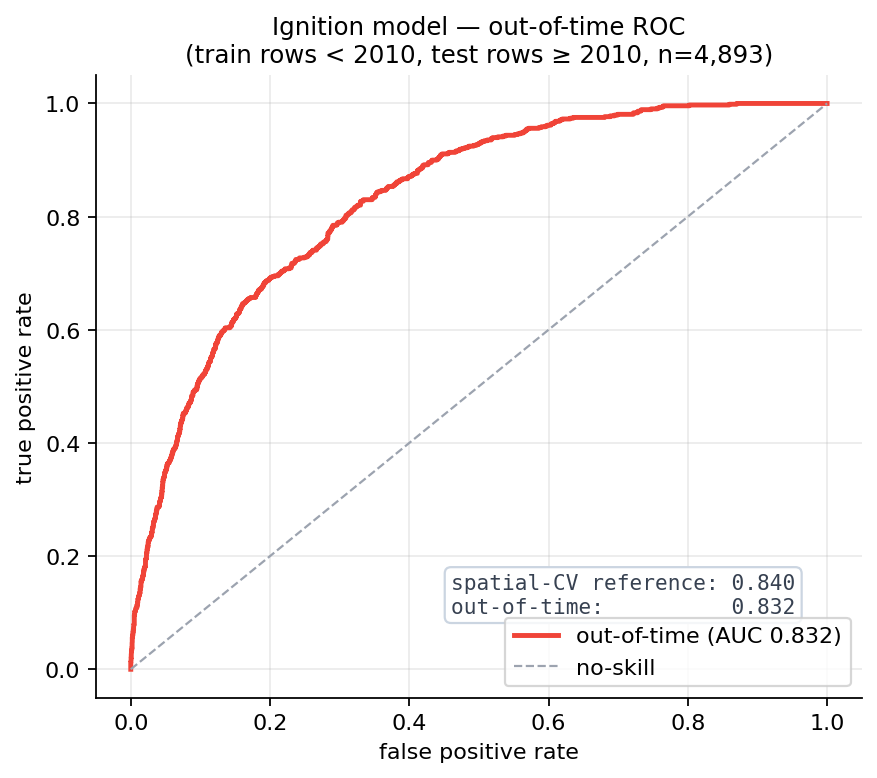
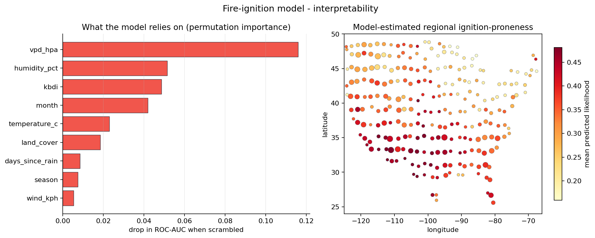

# Model Card: Fire-Ignition-Likelihood Model

An interpretable machine-learning model that estimates how much a location's current conditions resemble the days wildfires have actually started. See [METHODOLOGY.md](METHODOLOGY.md#signal-2-ignition-likelihood) for how this model is used in the scoring algorithm.

## Overview

| Field | Value |
|---|---|
| **Task** | Binary classification: "fire-start day" vs "typical day" at a location |
| **Output** | A calibrated ignition-likelihood percentile (0 to 100) and a `low` / `moderate` / `high` / `extreme` level |
| **Question it answers** | *Do today's conditions look like a day fires start?* (occurrence). Distinct from the fire-weather index's *how bad could a fire get?* (severity) |
| **Model** | Gradient-boosted decision trees (`HistGradientBoostingClassifier`) with isotonic calibration |
| **Served at** | `GET /ignition?lat=&lon=`, shown as a card on the Status screen |
| **Version** | Trained 2026-07-05 on FPA-FOD 1992 to 2015. Served from the committed `api/models/ignition_model.joblib`. |

## Training Data

Every example is one location on one day, labeled fire-start or typical and described only by its weather and fuel. Three groups make up the set:

- **Positives (4,897).** The conditions on the day a real fire ignited, taken from the federal FPA-FOD database (1992 to 2015) and matched to that day's weather and KBDI drought from the Open-Meteo archive.
- **Same-location negatives (24,485).** For each fire, "typical days" drawn from the same location on other days, using the 365-day weather window already cached for that fire. Pulling positives and negatives from the same places is deliberate. Fire records are spatially biased, since fires get reported where people are looking, and sharing locations between the two classes cancels that bias out instead of letting the model learn "this region gets reported more."
- **Background negatives (3,000).** Typical days at locations that do not burn, spread across the continental US (CONUS). Without these, every location in the data would be a fire location, and the model would have no way to learn that a low-fuel city block ignites far less than dry brush no matter the weather (see [Fixing the Urban Over-Flag](#fixing-the-urban-over-flag) below).

32,382 examples total, 15.1% positive. That ratio is a training balance chosen for the model, not an estimate of how often fires actually start. Every feature is computed by the same function the live server uses, so training and serving see identical inputs.

**Features:** Daily-max temperature, mean humidity, VPD, daily-max wind, days-since-rain, KBDI drought, season, month, and land cover (the NLCD class: water, developed open/low/med/high, forest, shrub, grassland, cropland, wetland, barren). Developed land is kept split by intensity (open-space 21 versus dense-urban 24) so a grassy park is not treated like downtown. Latitude and longitude are left out on purpose, so the model keys on conditions and fuel.

## Evaluation

The evaluation is designed so the model cannot score well simply by memorizing locations. The main run is spatial-block cross-validation: whole 2-degree regions are held out at once, so a fire and its own same-location negatives can never land on opposite sides of the train/test split. A model that had only learned which places burn would score well on an ordinary random split but drop sharply here. Strong performance under this split is evidence that it is reading conditions.

| Metric (out-of-fold, spatial CV) | Model | No-skill |
|---|---|---|
| ROC-AUC | **0.840** | 0.500 |
| PR-AUC | **0.488** | 0.151 |
| Brier (raw to calibrated) | 0.163 to **0.100** | 0.128 |

About 15% of examples are fire days, which sets the no-skill PR-AUC line. The same base rate sets the no-skill Brier at 0.128, the score you get by predicting 0.151 for every row. The raw model is worse than that at 0.163, which is normal for uncalibrated boosted trees, and isotonic calibration brings it to 0.100, about 22% below no-skill. The gradient-boosted model improves on a logistic-regression baseline (0.798 ROC-AUC on the same data).

<picture><source media="(prefers-color-scheme: dark)" srcset="charts-dark/ignition_eval.png"></picture>

### Tested Across Time

Spatial cross-validation holds out regions but still mixes years, so it can train on a 2015 fire and test on a 2005 one. A stricter check trains only on rows before 2010 and tests on 2010 to 2015 (n=4,893), which is the situation the live model is actually in, since only the past is ever available. Discrimination barely moves: **0.832** out-of-time against **0.840** in spatial cross-validation, PR-AUC 0.481. A six-year forward gap costs almost nothing, which says the drivers are stable. Reproduce with `scripts/temporal_validation.py`.

<picture><source media="(prefers-color-scheme: dark)" srcset="charts-dark/temporal_validation.png"></picture>

### What the Model Relies On

The model relies on dryness. VPD, humidity, and KBDI take the top three spots by permutation importance, which is what fire science would predict and is evidence that the 0.840 reflects real conditions rather than an artifact of how the data was built. Season and month are not carrying it either. Retraining on weather and drought alone gives about 0.83 ROC-AUC, so the model is not just learning that fires happen in summer. Permutation ranks month fourth because the fitted model does use it, but the weather features absorb that signal once it is gone.

Wind ranks last here, the opposite of its weight in the fire-weather index. The index is fitted to fire size, and wind drives spread. This model predicts whether a fire starts, which turns on fuel dryness.

<picture><source media="(prefers-color-scheme: dark)" srcset="charts-dark/ignition_interpret.png"></picture>

## Fixing the Urban Over-Flag

The first version used weather features only and was trained entirely on fire-prone locations. With nothing in the data to say "there is no wildland fuel here," it over-rated quiet places. A cool, windy, low-drought spring day in dense-urban Chicago scored the **76th percentile** ("high") purely on a dry spell and wind. The fix came in two stages.

**Stage one, the training data.**

1. A land-cover feature that keeps developed intensity split. Combining the NLCD developed classes (21 to 24) into one "developed" category had hidden a real signal: dense-urban land (class 24) is only 0.6% of fire days, while grassy open-space development (class 21) is 5.3%. Separating them lets the model tell a downtown from a park.
2. The background negatives described above, so that "developed" is no longer always a fire location and the model can learn it ignites less.

Together these moved the Chicago reading from the 76th percentile down to the **61st**.

**Stage two, the calibration.** Two more fixes to the pipeline without touching the model's ranking:

1. Grouped out-of-fold calibration. The isotonic calibrator and the percentile reference are now fit on spatial out-of-fold scores, so a fire's positive day and its same-location negatives no longer leak into the step that sets the final numbers.
2. A symmetric days-since-rain ceiling. Each fire's negatives came from earlier in the same 365-day window as the fire, so their days-since-rain was capped by where they sat in the window, while the fire day and the live server (which reads the end of a fresh window) could run much higher. That gap was a shortcut the model could exploit. Capping every example at a shared ceiling removes it, and it also keeps live scoring from pushing arid locations past the range the model was trained on.

That brought the standalone Chicago reading to about the **39th percentile** ("low"), while fire-prone Phoenix and other high-risk places stayed high. Across both stages, discrimination held: spatial ROC-AUC went from 0.834 to 0.840. Developed areas still read a little high, and some of that is genuine, since they do see human-caused ignitions.

## Serving

- **Training/serving parity.** Live features come from the same `summarize_window_with_kbdi` function and the same Open-Meteo archive used in training, and days-since-rain is capped to the same ceiling, so the model never sees an input shaped differently from what it learned on.
- **Percentile output.** The calibrated probability is mapped to a percentile against a reference distribution of out-of-fold scores, so the card shows where today sits relative to history.
- **Graceful degradation.** If the model or the upstream weather is unavailable, the endpoint returns `null` and the UI hides the card.
- **Levels.** The percentile maps to a level at fixed cuts: low below 50, moderate 50 to 74, high 75 to 89, extreme 90 and above.

## Intended Use & Interpretation

- It is a relative likelihood index, not an absolute "chance of a fire today." It is calibrated against the training set's fire-day ratio (the constructed ~15%), so it tells you how fire-start-like today's conditions are compared with history.
- Its weather comes from the Open-Meteo archive, which lags about 6 days. That date is shown on the card.
- It is informational, not an emergency or operational tool (see the site disclaimer).

## Limitations

- **Training data ends in 2015.** The model runs against present-day weather, so the gap is over ten years and growing. The out-of-time test covers six years with almost no loss, which suggests the drivers are stable, but it does not measure a gap this size. Refitting on newer records is the fix.
- **The positives inherit FPA-FOD's reporting bias.** Same-location negatives cancel the spatial part of that bias. They do not change the composition of the positive set, which skews toward fires near roads and settlement.
- **Spatial blocks share climate.** Holding out 2-degree regions rules out location memorization. It does not rule out the model keying on regional climatology. The out-of-time result is the stronger evidence there.
- **The percentile is relative to 1992 to 2015.** "Where today sits relative to history" means that history.

## Reproduce

```bash
python scripts/build_background_negatives.py  # non-fire background negatives (quota-limited, resumes)
python scripts/build_ignition_dataset.py      # dataset (fire + background, land-cover enriched)
python scripts/train_ignition_model.py        # baseline + GBM + spatial-CV scores
python scripts/evaluate_ignition_model.py     # calibration + ROC/reliability chart
python scripts/temporal_validation.py         # out-of-time holdout (train<2010, test>=2010)
python scripts/interpret_ignition_model.py    # permutation importance + regional map
python scripts/train_final_ignition_model.py  # final calibrated artifact -> api/models/
```
