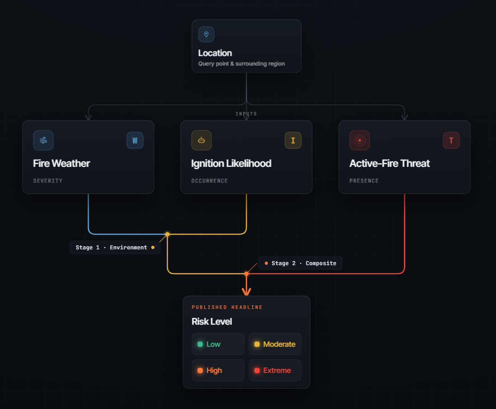
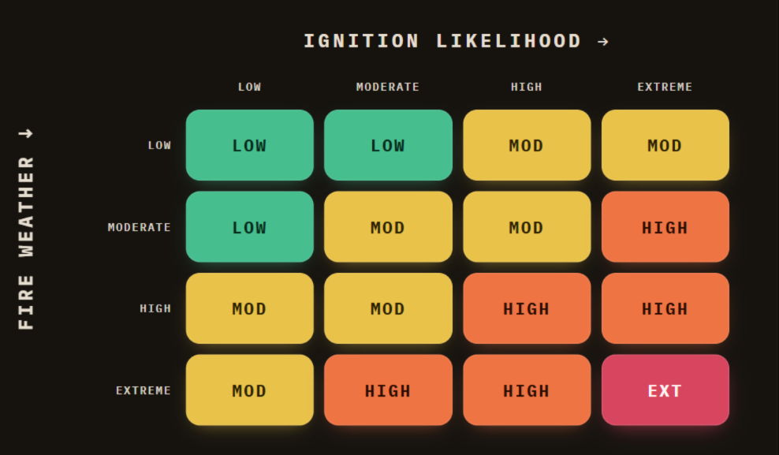
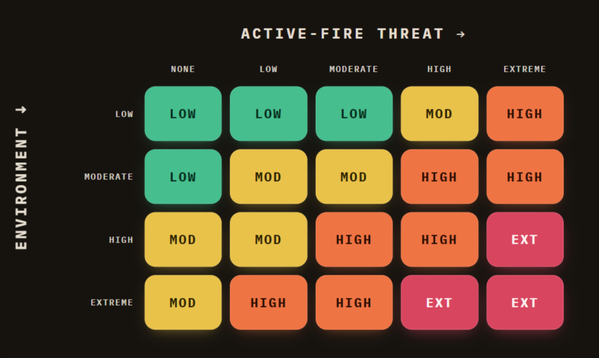
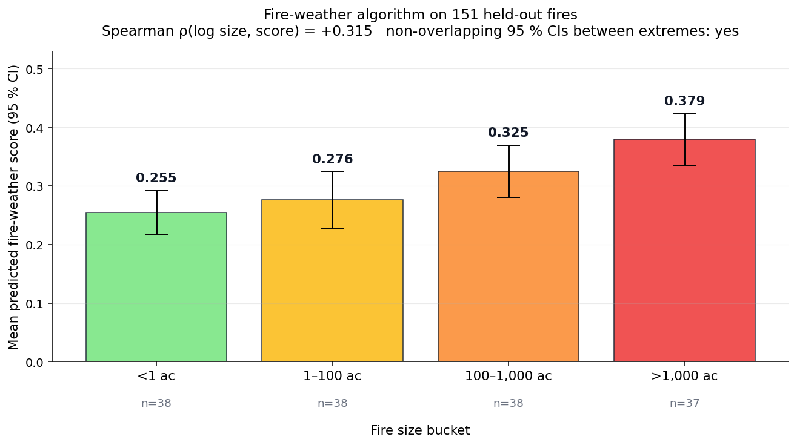

# Methodology

This is the technical reference for how WatchFlame turns a location into one risk tier. It covers the three signals, how they combine into a single tier, and how the scoring is calibrated and validated. The [README](../README.md) is the higher-level overview.

## Scoring Overview

A location produces three independent signals. Two lookup tables fold them into one tier.

 

## Signal 1: Fire Weather

A rule-based index that grades the local environment for fire ignition and growth on a 0 to 1 scale.

Three weather factors combine multiplicatively, then a vegetation factor scales the result:

<table><tr><td align="center">

$\text{score} = \left(\text{VPD}^{0.45} \times \text{wind}^{0.43} \times \text{drought}^{0.12}\right) \times \text{vegetation}$

</td></tr></table>

A fire needs heat, dryness, wind, and fuel together. Because the factors multiply, any one of them being low significantly lowers the score, no matter how extreme the others are.

**The four inputs.**

| Input | What it is | Detail |
|---|---|---|
| **VPD** | Vapor pressure deficit from temperature and humidity (Tetens/Magnus) | The dominant driver |
| **Wind** | Sustained 10-minute speed | Saturates at a 52 km/h plateau (~32 mph), floored at 0.0458 so calm days still register |
| **Drought** | Keetch-Byram Drought Index (KBDI, 0 to 800) | Soil-moisture deficit from a 365-day precipitation and evapotranspiration window (Open-Meteo). The drought factor is floored at 0.2786 so days after rain still register |
| **Vegetation** | NDVI anomaly: current greenness minus the 3-year same-month normal over a 1 km buffer (ESA Sentinel-2 via Copernicus) | Below normal raises the multiplier, above normal lowers it. When a cloud-blocked pass leaves NDVI unavailable, it falls back to a calendar season factor (winter 0.40, spring 0.80, summer 1.00, fall 0.90) |

The exponents, saturation scales, and floors live in a `RiskParams` dataclass in [api/core/risk_algorithm.py](../api/core/risk_algorithm.py) and are fitted against historical fires. To see how they are fitted and validated, see [Performance and Validation](#performance-and-validation) below.

 

## Signal 2: Ignition Likelihood

A separate machine-learning model that answers a different question: Do today's conditions resemble the days fires actually start? It predicts occurrence, unlike the fire-weather index, which scores severity. Served at `/ignition` as a calibrated percentile and shown next to the fire-weather tier on Status.

It is a gradient-boosted classifier (`HistGradientBoostingClassifier`).

**The inputs:**
- Dryness: VPD, humidity, temperature
- Drought: KBDI and days since rain
- Wind
- Time of year
- NLCD land-cover class, with a developed-intensity split

The model is not given latitude or longitude. Giving it coordinates lets it learn which places have burned before and flag them regardless of conditions. Without them, it has to rely on conditions and fuel, so the score transfers to regions with no fire history.

**Training data.** 32,382 examples. The 4,897 positives are real fire-ignition days (FPA-FOD and Open-Meteo). The negatives are "typical day" rows, drawn both from those same fire locations and from 3,000 non-fire background locations (`scripts/build_ignition_dataset.py`).

Its measured performance is in [Performance and Validation](#performance-and-validation) below, and the full training, calibration, and evaluation details are in the [model card](IGNITION_MODEL_CARD.md).

 

## Signal 3: Active-Fire Threat

The first two signals are about conditions. This one scores fires that are already burning, weighing how close a fire is and how big it is.

Per-fire threat multiplies a distance factor by a size factor:

<table><tr><td align="center">

$\text{base} = e^{-d/\tau} \cdot \text{taper}(d) \times \left[\text{floor} + (1 - \text{floor}) \cdot \dfrac{\text{acres}}{\text{acres} + K}\right]$

</td></tr></table>

with $\tau = 21$ mi, floor $= 0.70$, and $K = 300$ ac.

These constants are hand-tuned, not fitted. The fire-weather index could be fit because every historical fire has a recorded size to score against. Threat has no such label: no dataset says how dangerous a given fire was to a given point at a given moment. The distance scale, size half-saturation, and modifier ranges were set by hand to behave sensibly across cases, so read them as a design choice rather than a measured result.

### Threat Modifiers

Three factors then adjust the base threat up or down. These are what make the score directional and current.

- **Wind alignment** ranges from ×1.20 when the wind is driving the fire toward you to ×0.80 when it is pushing the fire away, scaled by the angle between them.
- **Containment** eases the score toward ×0.6 as a fire moves past 75% contained.
- **Detection age** eases the score toward ×0.6 once a detection is more than 24 hours old.

**Other refinements.**

- The size factor rises with acreage and never fully caps, so a megafire still outranks a merely large fire.
- Satellite detections from FIRMS do not report acreage, so their size factor stays neutral at 1.0 and distance alone drives the threat.
- Only fires within 50 miles count, and the cutoff is gradual: a fire's contribution fades between 46 and 50 miles.
- The final threat comes from the single highest-scoring fire in range, so the headline number and the fire named as its driver can never disagree.

 

## Combining the Three Signals

Two lookup matrices in series ([web/lib/composite-risk.ts](../web/lib/composite-risk.ts)) combine the three signals into a single risk tier. A formula would force every combination onto one smooth curve. A matrix lets each cell be set directly, so a case like high ignition on a low-severity day lands at the right tier without shifting any of the others.

**Stage 1: Environment.** Fire-weather severity `W` and ignition likelihood `I` are both weather-driven, so they combine first into one environmental-danger tier, `E = ENV[W][I]`. The cells follow a consequence-times-likelihood intuition, but each one is set by hand rather than computed from it.

 

**Stage 2: Composite.** The environment tier is then combined with the active-fire threat `T` through a 4 by 5 matrix. This is the risk tier shown on the Status screen, where the UI labels it Risk Level.

 

## Performance and Validation

Two things back the scoring system: local calibration and held-out validation.

### Per-State Calibration

The raw 0 to 1 fire-weather score is bucketed into LOW / MODERATE / HIGH / EXTREME, and the boundaries are calibrated per state. Each state's bands are set from the 50th / 75th / 97th percentiles of its own historical fire-day scores, so the same raw score can land at EXTREME in one state and HIGH in another.

17 states are fitted (the West, the Southeast belt, TX, and OK), covering the highest-fire-risk regions. The rest fall back to global cutoffs of 0.3 / 0.6 / 0.8. The state is resolved at request time by the US Census reverse-geocoder, which is accurate even at border points like Reno, NV that a bounding-box heuristic would misclassify. Source data is the FPA-FOD database (~1.88M wildfires, 1992 to 2015), with up to 100 fire-days sampled per state (1,637 across the 17). This per-state sample is separate from the frozen 498-fire benchmark used below.

<picture><source media="(prefers-color-scheme: dark)" srcset="charts-dark/regional_thresholds.png"></picture>

### Fire-Weather Validation

The constants for the fire-weather formula are fitted to maximize Spearman ρ(score, log fire size) on a 70/30 train split, and the result is reported on the held-out test split. Fitting lifts the test ρ from +0.26 (the original hand-picked constants) to **+0.315**. On the same held-out fires the raw Hot-Dry-Windy Index scores +0.304 and Fosberg FFWI +0.281, so at this sample size the three are statistically indistinguishable (the standard error on ρ at n=151 is about 0.08). The fitted fire-weather index matches the established Hot-Dry-Windy and Fosberg indices. Only the weather-driver constants are fit. The vegetation factor and the season multipliers are held fixed, since the hindcast cannot replay historical Sentinel-2. This frozen 498-fire benchmark lives in a CSV so fitting and chart regeneration run offline and reproducibly.

Mean score is flat across the two smallest size classes, then rises clearly above 100 acres, with non-overlapping 95% confidence intervals between the smallest and largest bins.

<picture><source media="(prefers-color-scheme: dark)" srcset="charts-dark/fireweather_validation.png"></picture>

<picture><source media="(prefers-color-scheme: dark)" srcset="charts-dark/fireweather_benchmark.png"></picture>

### Ignition Model Validation

Leakage-safe spatial-block cross-validation gives **ROC-AUC 0.840**, holding at 0.832 on a separate out-of-time test. Full metrics, calibration, and the limitations are in the [model card](IGNITION_MODEL_CARD.md).

<picture><source media="(prefers-color-scheme: dark)" srcset="charts-dark/ignition_eval.png"></picture>

 

## Design Decisions

### The Drought Floor

When the constants for the fire-weather formula were fitted freely, the optimizer pushed the drought (KBDI) exponent down toward 0.03, almost dropping drought out of the formula.

That happens because the fit is tuned to predict fire size, and fire size is driven mostly by wind and dryness (VPD). Drought, a slow measure of soil moisture, adds little to predicting how big a fire gets, so the optimizer saw little reason to keep it.

But removing drought would leave the entire KBDI calculation doing nothing, even though drought clearly matters for fire risk in general. So the drought exponent is not allowed to fall below 0.12, which keeps all three weather factors genuinely contributing. The model's +0.315 correlation with actual fire size (from the Fire-Weather Validation section above) would improve by only 0.006 without the floor. That is far too small to matter. The fitted value lands right on the floor, which shows the optimizer would have gone lower if it could. That small loss is a deliberate trade for a model where all three factors keep pulling weight.

### Two Weather Sources

The site pulls weather from two providers because the score needs two different time horizons.

Current conditions come from OpenWeatherMap: live temperature, humidity, and wind. Those drive the fire-weather score, and a reading of today's danger has to be current.

Drought works differently. KBDI is a running daily accumulator, where each day's value carries forward from the day before and is adjusted by that day's rain and evaporation. A current-conditions API cannot produce it, because there is no prior state to add today's rainfall to. KBDI needs the full history rebuilt, which comes from the Open-Meteo archive. The archive is free and reaches back years, and it also feeds the ignition model, so the drought signal and the model's training data share one source.

The archive trails real time by about 6 days. Over a year-long accumulator that lag moves the number very little, but for live wind and humidity it would be too stale. The cost is two integrations to maintain, with separate keys, rate limits, and fallback paths.
